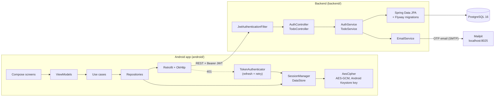

# TodoListAppAndroidFullStack

A full-stack todo app: a **Jetpack Compose** Android client and a **Spring Boot (Kotlin)** REST API,
with email/password auth, JWT access + rotating refresh tokens, and OTP password reset.


## Screenshots

| Login | Todo list | Add / edit | Password reset |
|:---:|:---:|:---:|:---:|
|  |  |  |  |

## Architecture



The Android app follows a clean-architecture layout per feature (`feature/auth`, `feature/todo` →
`data` / `domain` / `presentation`), with Hilt for DI, Room, and Navigation 3.

## Quick start

**1. Backend** (only Docker needed: no local Java, Gradle or Postgres):

```bash
docker compose up --build
```

This starts PostgreSQL, a local [Mailpit](https://mailpit.axllent.org/) inbox and the API:

- API: <http://localhost:8080> (endpoints: see [backend/README.md](backend/README.md#api))
- Mailpit inbox for password-reset OTP emails: <http://localhost:8025>

The defaults work out of the box. To override them (DB credentials, JWT secret, real SMTP),
`cp backend/.env.example backend/.env` and edit. `.env` is gitignored.

**2. Android app:** open `android/` in Android Studio and run the **`proDebug`** variant on an
emulator. It points at `http://10.0.2.2:8080/`, which is the host machine's `localhost`.

## Design decisions worth a look

- **Refresh-token rotation.** Refresh tokens are opaque random values stored only as SHA-256
  hashes. Every `/api/auth/refresh` revokes the presented token and issues a new pair, so a
  refresh token works once. Resetting a password revokes all of that user's refresh tokens,
  and a scheduled job purges expired ones.
  → [`AuthService.kt`](backend/src/main/kotlin/com/todoauth/service/AuthService.kt)
- **Per-user data isolation.** The user id always comes from the verified JWT, never the
  request body. Every todo query is scoped by it (`findByIdAndUserId`, `deleteByIdAndUserId`, …),
  so another user's todo returns 404 and its existence is never confirmed.
  → [`TodoRepository.kt`](backend/src/main/kotlin/com/todoauth/repository/TodoRepository.kt)
- **Encrypted token storage.** Access/refresh tokens are encrypted with AES-256-GCM before being
  written to DataStore. The key is generated inside the Android Keystore, so it never leaves it.
  → [`AesCipher.kt`](android/app/src/main/java/com/androidapp/todolistapplication/core/security/AesCipher.kt),
  [`SessionManager.kt`](android/app/src/main/java/com/androidapp/todolistapplication/core/datastore/SessionManager.kt)
- **Transparent session refresh.** The API returns JSON `401` for missing or expired tokens (and
  `403` for forbidden ones). An OkHttp `Authenticator` catches the 401, refreshes once under a lock
  so parallel requests don't race, and retries. If the refresh fails, the session is cleared.
  → [`TokenAuthenticator.kt`](android/app/src/main/java/com/androidapp/todolistapplication/core/network/TokenAuthenticator.kt)
- **Abuse-resistant password reset.** OTPs expire, allow limited verify attempts and are
  rate-limited per hour. All of this is configurable through env vars.

## Repo layout

```
android/   Jetpack Compose client        → android/README.md, android/docs/TESTING_NOTES.md
backend/   Spring Boot API + Dockerfile  → backend/README.md (full API reference + curl examples)
docs/      README assets
```
